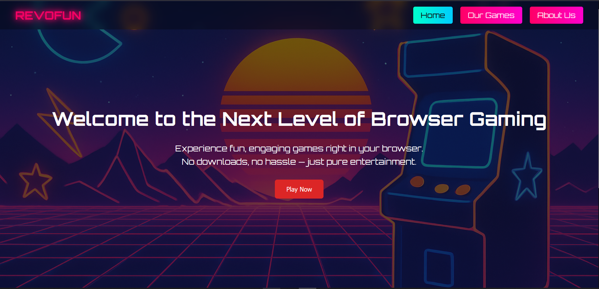
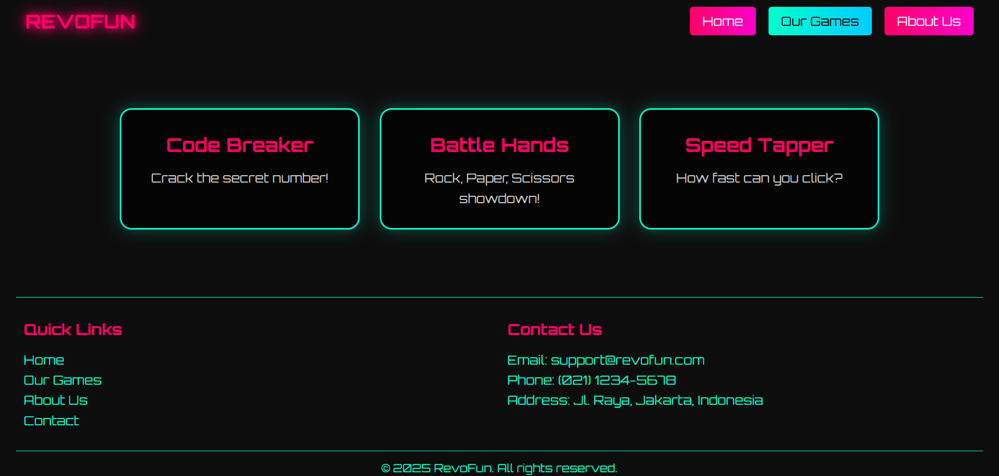
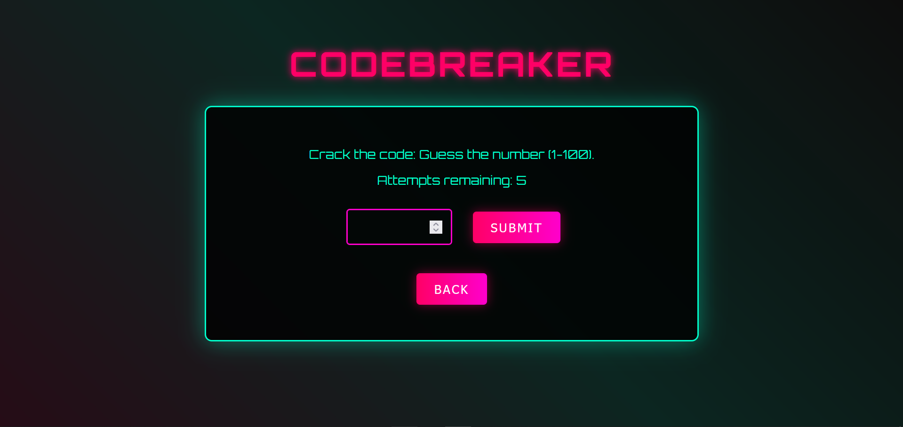
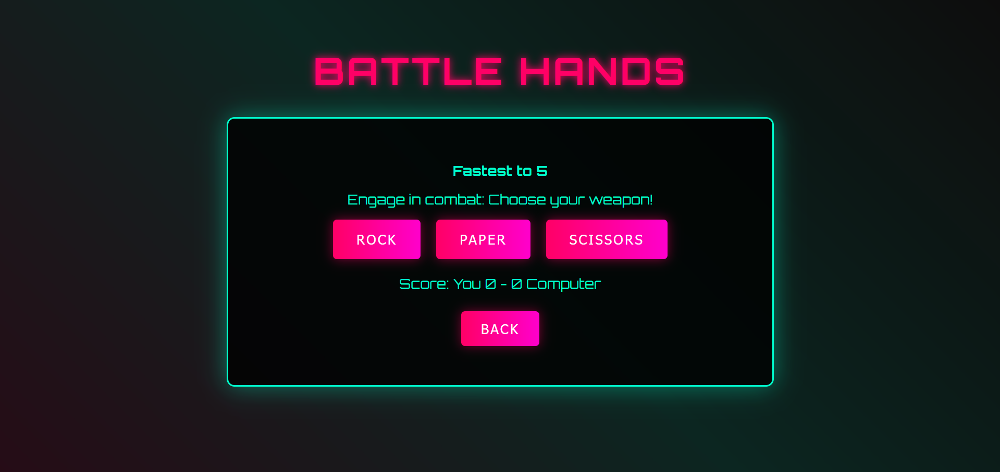
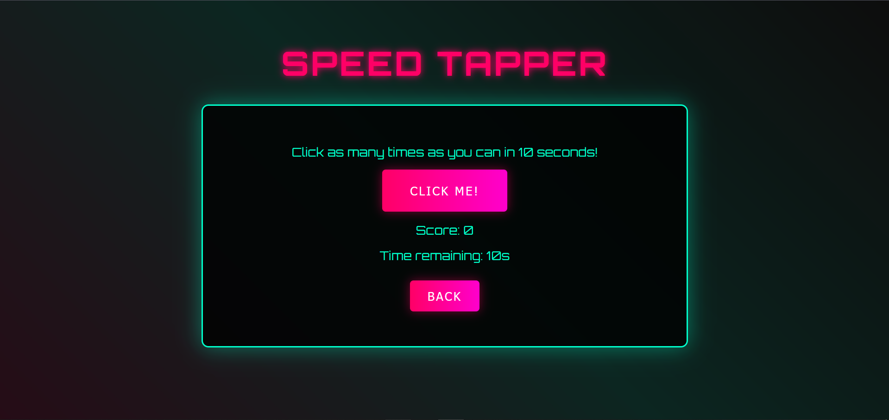

# 🎮 RevoFun 🎮

## 📌 Overview

**RevoFun** is an interactive web project that features three classic browser-based games, built using HTML, CSS, and JavaScript. This project is designed to offer a light, fast, and fun gaming experience without the need for any additional installation. Perfect for learning purposes or casual entertainment.

---
## 🎯 Live Demo

Check this out 🚀
[RevoFun](https://revou-fsse-feb25.github.io/milestone-2-MuhammadIrfanDzaky/)

---

## ✨ Features Implemented

- ✅ **Landing Page** (`index.html`) as an informative and attractive introduction page
- ✅ **Games Page** (`games.html`) that displays a selection of three games
- ✅ **Game 1: Number Guessing**
  - Guess a number between 1–100
  - Provides hints (too high / too low)
- ✅ **Game 2: Rock Paper Scissors**
  - Play against the computer
  - Random results with live scoring
- ✅ **Game 3: Clicker Game**
  - Click as many times as possible in 10 seconds
  - Score calculation based on time
- ✅ **Navigation System**
  - Navigate between pages with back/home buttons for better UX

---

## 🛠 Technologies Used

| Technology | Description |
|-----------|------------|
| HTML5     | Page structure and game content |
| CSS3      | Responsive styling and UI aesthetics |
| JavaScript | Game logic and event handling |

No additional frameworks or libraries used — everything is built with **vanilla JavaScript** and **pure CSS**.

---

## 🖼 Screenshots

### ✨ Landing Page
Features a visually appealing hero section. 


### 🎮 Games Page
Displays three game options for users to choose from.


### 🔢 Number Guessing Game
Guess the secret number from 1–100.


### ✊✋✌️ Rock Paper Scissors
Choose between Rock, Paper, or Scissors.


### ⏱️ Clicker Game
Click as much as possible within a limited time.


---

## 💡 Getting Started

1. **Clone the repository**.
    ```bash
    git clone https://github.com/revou-fsse-feb25/milestone-2-MuhammadIrfanDzaky.git
    ```
2. **Change the directory**.
    ```
    cd milestone-2-MuhammadIrfanDzaky
    ```
3. **Open the Project:**

   Open the `index.html` file in your preferred web browser or use a live server extension (like Live Server in VS Code) for real-time updates.

4. **Customize:**

   Modify the content, images, and styles in the CSS and HTML files to reflect your personal information and projects.

---
## 👤 Author & Credits

**Developer:** Muhammad Irfan Dzaky  
**Email:** irfndzky@gmail.com  
**GitHub:** [github.com/MuhammadIrfanDzaky](https://github.com/MuhammadIrfanDzaky)

feel free to use and modify it for your personal or educational projects.

